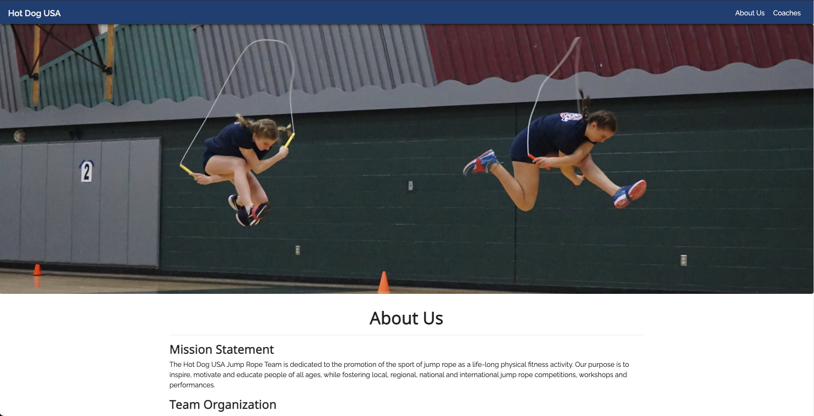

# Hot Dog USA

## 

## Purpose

Simple React App for a local Jump Rope Team.

## Contributing

- Fork it (https://github.com/klleroy/hdusa/fork)
- Create your feature branch `git checkout -b feature/hdusa`
- Commit your changes git commit -am 'Add your Message Here'
- Push to the branch git push origin feature/hdusa
- Create a new Pull Request

## Support

- Open a new issue [here](https://github.com/klleroy/hdusa/issues/new) for support.

## License

This project is licensed under the MIT License - see the [LICENSE](LICENSE) file for details.
